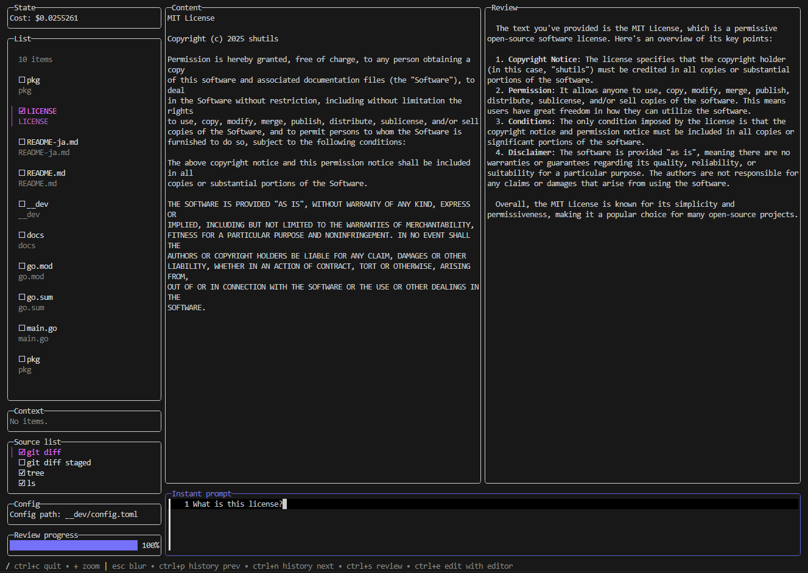
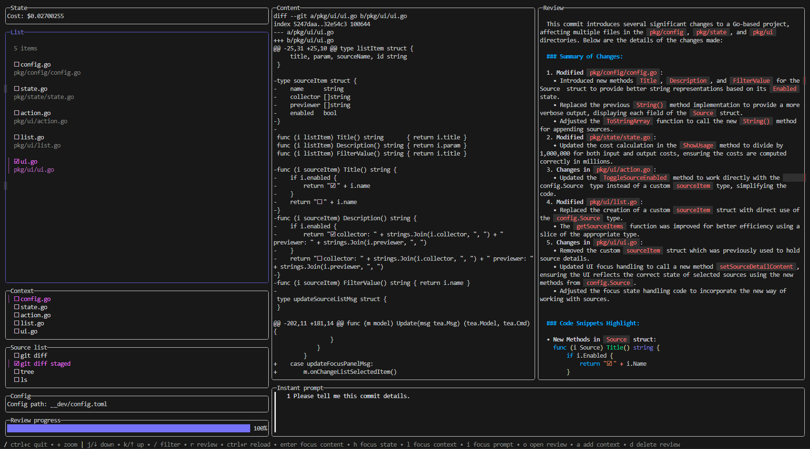

# lazyreview

ターミナル上でAIとコードレビューするアプリケーションです

## Description

`lazyreview` は、GPT-4oなどのAIモデルを使用してコードレビューを生成します。  
ソースを設定することで様々なコンテキストを集めてレビューが実行できます。



## Installation

現在はgoでのインストールのみサポートしています。

```sh
go install github.com/shutils/lazyreview@latest
```

もし開発中の最新のバージョンが使用したい場合は以下のコマンドを実行してください。

```sh
go install github.com/shutils/lazyreview@dev
```

## Configuration

This application is configured with a toml file.
このアプリケーションでは、tomlファイルを使用して設定を行います

for example:

<details><summary>config.toml</summary><div>

```toml
type = "azure" # "openai" or "azure" 何も設定しない場合は"openai"が使用されます。
key = "<your-key>" # 使用するAPIキーです。
endpoint = "<your-endpoint>" # 使用するAIのエンドポイントです。typeがazureのときのみ必要です。
version = "<your-version>"  # 使用するAIのバージョンです。typeがazureのときのみ必要です。
model = "<your-model>" # 使用するモデルです。デフォルトでは"gpt-4o-mini"が設定されます。
target = "." # アイテムを収集する際のターゲットディレクトリです。collectorが設定されていない場合に使用されます。
output = "reviews.json" # レビュー結果を出力するファイルです。設定しない場合はxdg仕様に従って出力されます。
ignores = [".git"] # デフォルトで収集したアイテムをフィルタリングします。

# AIに渡すプロンプトです。インスタントプロンプトやソースごとのプロンプトが指定されていない場合のみ使用されます。
prompt = '''
You are a code reviewer. Please review the user's code based on the following points.

1. Code quality
2. Code readability
3. Code efficiency
4. Code security
5. Code maintainability
6. Code scalability
7. Typos and bugs

Please provide appropriate suggestions in Markdown format when answering.
'''
max_tokens = 2000 # AIに許可する最大トークンです。
glamour = "dark" # レビュー結果を装飾して表示する設定です。現在は"dark", "light", ""がサポートされています。
opener = "nvim" # レビューを開いたりプロンプトを入力する際に使用されるコマンドです。
# opener = ["code", "--wait"] # コマンドは配列形式でも渡せます。Visual Studio Codeで--waitオプションを使用してコマンドを実行する際に便利です。

[modelCost]
input = 0.15 # 1Mトークン当たりの$
output = 0.6 # 1Mトークン当たりの$

# アイテムを集める際に使用されるソース設定です。
[[sources]]
name = "git diff" # 名前です。ユニークである必要があります。
enabled = false # このソースを使用するかどうかを決めます。TUI上で簡単に切り替えられます。
collector = "git diff --name-only" # アイテムを集めるコマンドです。出力は行で区切られてアイテムに変換されます。
previewer = "git diff" # アイテムを表示するコマンドです。

[[sources]]
name = "git diff staged"
enabled = false
collector = "git diff --name-only --cached"
previewer = "git diff --staged"

[[sources]]
name = "grep main.go"
enabled = false
collector = ["sh", "-c", "ls | grep main.go"] # コマンドは配列形式でも渡せます。パイプ等を使用したい場合はこちらの記法を使用します。
previewer = "cat"

[[sources]]
name = "docker ps"
enabled = false
collector = 'docker ps --format "{{.Names}}"' # 名前のみ取得
previewer = "docker logs" 
```
</div></details>

## Usage

```sh
lazyreview [--config <config-file>]
```

configファイルを指定しない場合は、xdgの仕様にしたがってファイルを生成します。

## Example

- git diff
  
