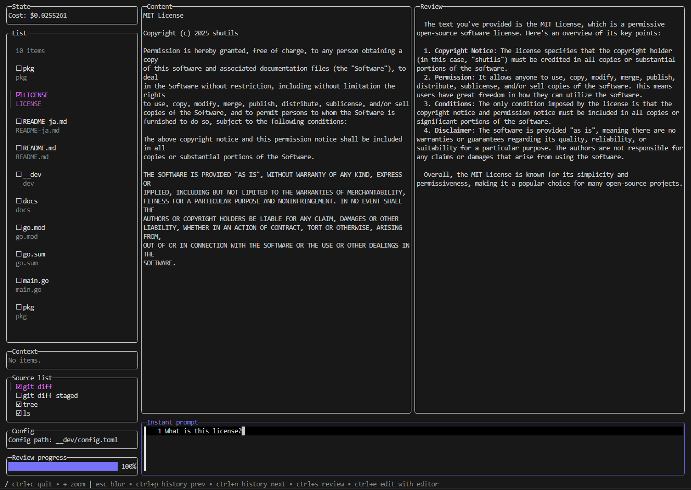

# lazyreview

A terminal-based application for AI-assisted code review.

## Description

`lazyreview` generates code reviews using AI models like GPT-4o. By configuring the source, you can collect various contexts for review execution.



## Installation

Currently, installation is only supported for Go.

```sh
go install github.com/shutils/lazyreview@latest
```

If you want to use the latest development version, run the following command:

```sh
go install github.com/shutils/lazyreview@dev
```

## Configuration

This application is configured with a TOML file.

For example:

<details><summary>config.toml</summary><div>

```toml
type = "azure" # "openai" or "azure". If not set, "openai" is used.
key = "<your-key>" # API key to use.
endpoint = "<your-endpoint>" # AI endpoint. Required only when type is "azure".
version = "<your-version>"  # AI version to use. Required only when type is "azure".
model = "<your-model>" # Model to use. Defaults to "gpt-4o-mini".
target = "." # Target directory when collecting items. Used if collector is not set.
output = "reviews.json" # File to output review results. If not set, output follows XDG specifications.
ignores = [".git"] # Default filters for collected items.

# Prompt for AI. Used only if instant or source-specific prompts are not specified.
prompt = '''
You are a code reviewer. Please review the user's code based on the following points.

1. Code quality
2. Code readability
3. Code efficiency
4. Code security
5. Code maintainability
6. Code scalability
7. Typos and bugs

Please provide appropriate suggestions in Markdown format when answering.
'''
max_tokens = 2000 # Maximum tokens allowed for AI.
glamour = "dark" # Display style for review results. Currently supports "dark", "light", "".
opener = "nvim" # Command used to open reviews or input prompts.
# opener = ["code", "--wait"] # Commands can be passed as an array. Useful when executing commands with the --wait option in Visual Studio Code.

[modelCost]
input = 0.15 # $ per 1M tokens
output = 0.6 # $ per 1M tokens

# Source settings for collecting items.
[[sources]]
name = "git diff" # Unique name.
enabled = false # Whether to use this source. Can be toggled via TUI.
collector = "git diff --name-only" # Command to collect items. Output is converted into items line by line.
previewer = "git diff" # Command to preview items.

[[sources]]
name = "git diff staged"
enabled = false
collector = "git diff --name-only --cached"
previewer = "git diff --staged"

[[sources]]
name = "grep main.go"
enabled = false
collector = ["sh", "-c", "ls | grep main.go"] # Commands can be passed as an array. Use this format for piping.
previewer = "cat"

[[sources]]
name = "docker ps"
enabled = false
collector = 'docker ps --format "{{.Names}}"' # Retrieve only names.
previewer = "docker logs"
```
</div></details>

## Usage

```sh
lazyreview [--config <config-file>]
```

If no config file is specified, a file will be generated following XDG specifications.

## Example

- git diff
  

